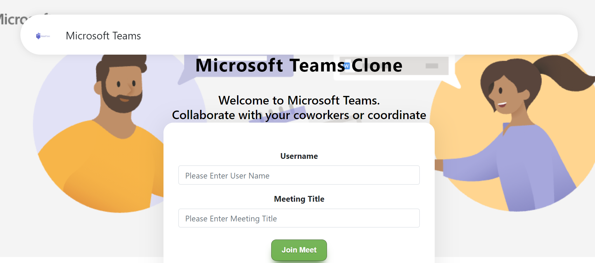
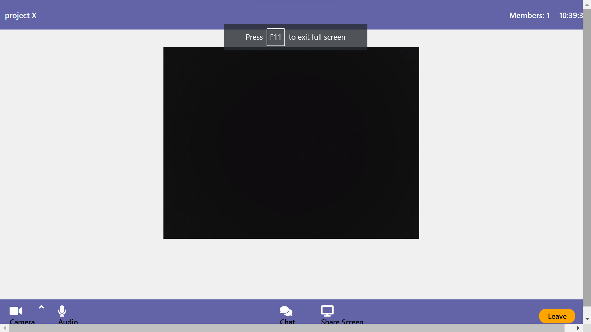

# Microsoft-Teams-Clone
Developed Microsoft Teams Clone -- the ultimate messaging app for teams as a part of course "Cloud Computing (CSE-569)".
It is a workspace for real-time collaboration, communication and meetings. It is open to use on any browser and accessible to everyone.

### Screenshots:
<li> HomePage  

<li> Meeting Room  

### Features Implemented:
<li> Group meeting/video calls
<li> Group Chatting (Within the meeting)
<li> Screen sharing
<li> Set Custom Meeting title/ room name and share with other participants to invite them to the meeting.
<li> Mute/Unmute Audio Video
<li> Responsive Design

### Tech Stack:
| Name | Version | Description
| ------ | ------ | ------ |
| Node JS | 14.15.3 | Node.js is an open source development platform for executing JavaScript code server-side. It is useful for developing applications that require a persistent connection from the browser to the server and is suitable for real-time applications. Node.js is intended to run on a dedicated HTTP server and to employ a single thread with one process at a time. Node.js applications are event-based and run asynchronously.  |
| Socket.io | 4.1.2 | Socket.IO is a JavaScript library for realtime web applications. It enables realtime, bi-directional communication between web clients and servers. It has two parts: a client-side library that runs in the browser, and a server-side library for Node.js. Whenever an event occurs, the server will get it and push it to the concerned connected clients. |
| Express | 4.17.1 | Express is a minimal and flexible Node.js web application framework that provides a robust set of features for web and mobile applications. It is an open source framework developed and maintained by the Node.js foundation. Express is used to build the web server that Socket.IO will work with. ExpressJS makes it easy to define routes and other things. |
| Simple-Peer | 9.7.2 | It is a concise, node.js style API for WebRTC. It allows peer to peer connection and supports video/voice streams. |
| React JS | 17.0.2 | ReactJS is JavaScript library used for building user interfaces or reusable UI components. It can be used on client and server side as well as with other frameworks. However, this front-end library is responsible only for the application’s view layer. React uses VDOM, which makes the web applications run much faster than those developed with alternate front-end frameworks.|
| Bootstrap | 4.3.1 | Bootstrap is the most popular HTML, CSS and JavaScript framework for developing a responsive and mobile friendly website. It includes HTML and CSS based design templates for typography, forms, buttons, tables, navigation, modals, image carousels, etc. It enables us to build responsive designs quickly and maintains wide browser compatibility. |
| Styled Components | 5.1.1 | Styled-components library allows us to write actual CSS in JavaScript code. It keeps track of which components are rendered on a page and injects their styles automatically. When we define our styles, we actually create a normal React component, that has our styles attached to it.|
| Nodemon | 2.0.4 | Nodemon is a tool from npm. This tool restarts our server as soon as we make a change in any of our files, otherwise we need to restart the server manually after each file modification. |

### Local Setup:

- Clone this repo to your local machine using `https://github.com/osamaataullah/Microsoft-Teams-Clone.git`

- Move to server folder, install the required packages, and start the server
<pre>
  <code>
    npm install
    node index.js
  </code>
</pre>

- Move to client folder, install the required packages, and run
<pre>
  <code>
    npm install
    npm start
  </code>
</pre>

- In case the website does not open automatically, open your local host port 3000 from your browser

